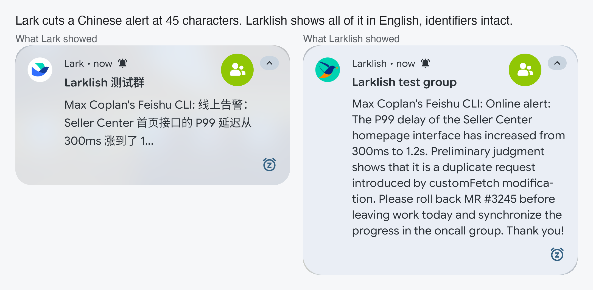
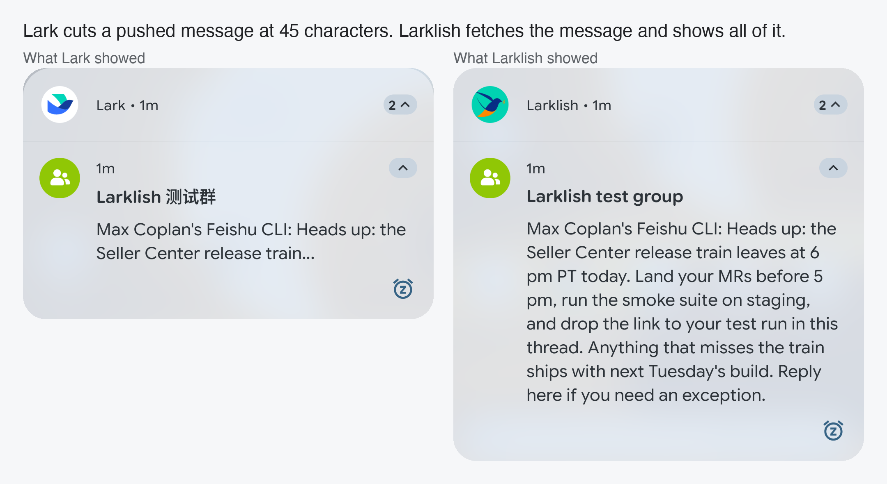
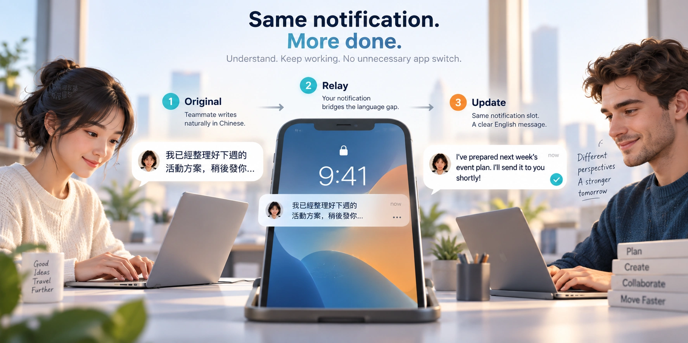
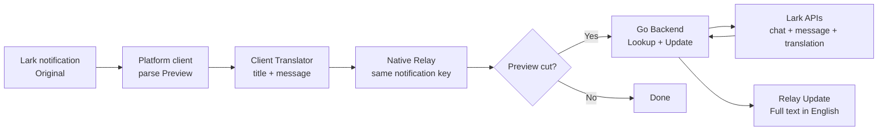
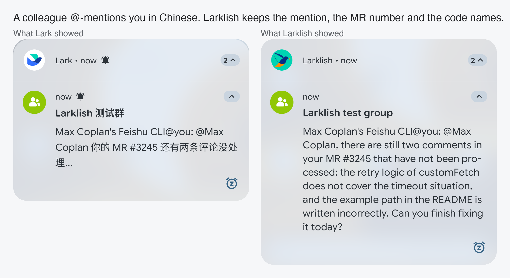

# Larklish: Make every Lark notification understandable

> **A language barrier should not become an attention barrier:** Larklish translates Lark notifications in-place and shows the full message, so you can understand and triage messages without opening Lark.
>

## The one-line pitch

Larklish is a full-stack, AI-powered notification bridge for cross-language teams. It listens to Lark notifications on your phone, translates the visible Preview, and replaces the Lark notification with an English Relay in the same place the Original appeared. When Lark has truncated the Preview, a Go Backend uses the user's Lark access to perform a targeted Lookup, retrieve the Full text, translate it, and Update the Relay.

The result is deliberately simple for the teammate using it: keep using Lark normally, but understand important messages immediately.

[Read the Larklish hackathon submission in Lark Docs](https://bytedance.us.larkoffice.com/docx/BuiYd05cvoXy4Vxp267uKodKsWg)

<!-- website: OpenAI ImageGen via Codex; prompt: Use case ads-marketing. Asset type editorial hero illustration for a hackathon product submission. Create a polished conceptual visual for a notification translation product: show one busy global-team professional in a natural everyday moment, glancing at a phone notification while also relying on hands-free audio. Communicate a language barrier becoming an attention barrier, then becoming understandable: a muted unreadable notification with Chinese glyphs transitions into a calm, readable English notification represented by clean abstract lines and a checkmark. Conceptual context, not a literal app screenshot. Clean split composition, left side muted and obstructed, right side calm and clear. Premium editorial illustration, modern product-marketing visual, subtle depth, crisp shapes, wide landscape, generous negative space, cool tense left side and warm relieved right side, charcoal, soft blue-gray, teal and orange accent, white. No brand logos, Siri interface, fake app UI, watermark, or illegible paragraphs of text; only a few large Chinese glyphs and simple abstract notification shapes. -->

*The product story in one picture: the message can stay in the sender’s natural language while the recipient gets an actionable notification.*

## The two everyday annoyances

Larklish starts from two related failures in the notification experience, not from an abstract desire to add another translation tool.

### 1. Voice assistants cannot reliably read the message

In the motivating setup, when a Lark notification arrives in Chinese, Siri says she cannot read the message. The notification may be present, but it is not accessible as spoken information. That matters when the user is walking, driving, cooking, exercising, or otherwise relying on audio instead of looking at the screen. A notification that cannot be understood cannot be triaged. Larklish addresses the underlying problem by putting an English Relay back into the native notification stream; platform-specific voice-assistant behavior is a client integration detail, not a requirement for the product’s core value.

### 2. The user must open Lark for every notification

The alternative is to open Lark every time, find the conversation, translate the message, and decide whether it needs a response. For a busy team, that is a lot of unnecessary app-opening and context switching. It turns every notification into a small interruption, even when most messages are not urgent.

| Everyday failure | Team consequence |
|-|-|
| **Voice assistant cannot read the message** | Spoken notifications fail at the moment the user needs hands-free awareness. |
| **Every notification requires opening Lark** | Triage becomes slow and disruptive, so important mentions, incidents, approvals, and launch changes are easier to miss. |
| **Long messages are truncated** | The visible Preview may omit the detail needed to decide what to do. |
| **Every sender is expected to solve the language gap** | People must change how they communicate, repeat messages, or rely on a colleague as a human translation layer. |

Larklish solves both headline annoyances at their shared boundary: it makes the notification understandable before the user has to open the app, and it puts the English result back into the native notification stream so it can be read or spoken normally.

*A real notification example: the Original is cut off, while the Larklish Relay preserves the complete operational detail and identifiers.*

<video controls preload="metadata" playsinline src="docs/showcase/larklish-gemini.mp4"></video>
<!-- website: https://gemini.google.com/u/1/app/642f12298fbf275; model: Gemini video generation via Flash Extended; prompt: Create an 8-second cinematic comedy commercial in landscape 16:9 for the new app called Larklish. A frazzled global-team professional is cooking dinner when one unreadable Chinese notification triggers absurd chaos: dozens of glowing notification bubbles swarm the kitchen, a smart speaker tries to read them and comically throws up its hands, and the professional grabs a giant magnifying glass to decode every message. Suddenly Larklish arrives as a tiny friendly superhero made of teal and orange light. The notification bubbles transform into one calm, clear English notification in the same place, the chaos vanishes, and the professional happily keeps cooking while the team continues working. End with a satisfying close-up of the calm notification and a playful wink. Warm, polished, exaggerated but believable, fast visual storytelling. -->

*One ordinary notification becomes an absurd emergency until Larklish makes it understandable.*

## The experience: one notification, two layers of help

Larklish keeps the phone’s notification workflow intact.

1. Lark posts an Original notification.
2. The Larklish client receives its title and text through the platform’s notification listener.
3. The client translates the text.
4. Larklish posts a Relay using the same notification key, so it occupies the same familiar notification slot.
5. If the Preview was complete, the Relay is done.
6. If the Preview was cut, the Backend performs a Lookup and Larklish sends an Update containing the Full text in English.

*A real long-message example: Lark truncates the Preview, and Larklish retrieves and shows the rest of the message.*

The user does not need to open a second app, copy text, or ask a colleague for help. The useful information arrives where the Original arrived.

<!-- website: OpenAI ImageGen via Codex; prompt: Use case ads-marketing. Asset type conceptual product story visual for a hackathon submission. Visualize the no unnecessary app switch benefit: show a phone notification as a small bridge between a sender writing naturally in Chinese and an English-speaking teammate continuing their work without opening the chat app. The notification begins as a compact Chinese Preview with an ellipsis and resolves into a clear English notification with a complete message, represented by readable short lines and a completion mark. Make it obvious that the same notification slot becomes useful. Minimal workspace with a phone in the foreground and subtle directional flow from Original to Relay to Update. Refined 3D product illustration, restrained and believable, not a fake screenshot, wide landscape, clear left-to-right narrative, optimistic, efficient, trustworthy, white, graphite, soft blue, teal, warm orange accent. No brand logos, Siri interface, fake Lark or Android UI, watermark, dense text, or random UI labels. -->

*Conceptual product flow: the same notification becomes useful without an unnecessary app switch.*

## Why Larklish is more than a translation API call

The hard part is the boundary between a notification system and a messaging system. Larklish handles the details that make the experience reliable:

- The app understands Lark’s actual notification shape: the title is the group name and the text begins with the Sender.
- It translates both the group title and the message Preview, preserving the Sender boundary.
- It preserves platform notification identity and follows Lark when Lark withdraws an Original.
- It detects whether the Preview is truncated instead of fetching every message, keeping the common path fast and inexpensive.
- It handles direct messages differently from group chats when resolving a conversation for a Lookup.
- It uses the Lark translation API first and keeps an on-device ML Kit fallback for cases where the API cannot provide a result. A `~` marker makes a fallback visible rather than silently pretending all translations came from the same path.
- It refreshes the user token through the normal Lark user-token chain. The Backend receives the user's access token per request; it does not own a long-lived user session.

These choices turn an apparently small feature into a complete, usable product loop.

## Full-stack architecture

### Frontend: a native experience that stays out of the way

The current app is intentionally focused. It owns notification interception, Preview parsing, translation, Relay/Update presentation, the user-token chain, recording, and the editable Backend URL. A future native client on another platform can implement the same small contract while reusing the Backend and product behavior. No client requires changes to the Lark app or cooperation from message senders.

The reference implementation is tested on a rooted Pixel 4a running LineageOS 23.2 / Android 16. That focus let the project optimize for a real end-to-end experience while keeping the product architecture open to other clients.

### Backend: only the expensive path leaves the phone

The Go Backend runs only when a notification Preview is incomplete. It performs the smallest useful Lookup:

`title → chat id → newest messages → matching message → Full text → translation`

It is stateless apart from an in-memory chat cache and LRU. It uses Go’s `net/http` and the official Lark Go SDK, with explicit Bearer authentication between the phone and Backend. The same service can run locally for development or as a ByteFaaS service in ByteCloud in production.

### AI and data handling

AI is used exactly where it creates user value: turning Chinese language into English at notification speed. The rest of the system is deterministic and testable: notification parsing, sender extraction, truncation detection, chat resolution, message selection, token handling, and notification replacement.

This division matters. The model or translation service handles language; code handles identity, routing, and safety-sensitive data flow. In the single-user demo, the notification Preview and the user's access token transit the configured Backend and Lark APIs; the Backend does not retain a long-lived user session.

## Proof that it works

Larklish has been built by testing the real layers separately and then joining them:

- A sideloaded listener receives real Lark Originals.
- The listener can be granted directly with Android’s notification service command; no special Settings detour is needed on the target device.
- Real test messages have produced English Relays on both Wi-Fi and cellular, with VPN off.
- A long-message probe produced a Relay with a recorded end-to-end time of **1,905 ms** from Original receipt to first Relay. The title translation took 1,341 ms and the message translation took 525 ms in that run.
- The live ByteFaaS Backend in ByteCloud has returned a real `found` Lookup with English available; the Full text hash matched on the deployment.
- The phone’s user-token file survived in-place APK installation byte for byte, and the notification listener stayed bound.
- Focused Backend tests, `go vet`, FE unit tests, formatting checks, static checks, and helper tests pass. There is also a full replay corpus the project maintains to make message-selection regressions visible.

The current acceptance boundary is clear: complete Previews are fully verified on the phone, and the Backend Lookup is verified live. A fresh phone probe that starts with an actually cut Preview is the remaining proof point for claiming the complete Relay-to-Update timing path on the deployed Backend.

<video controls preload="metadata" playsinline src="docs/showcase/larklish-byteartist.mp4"></video>
<!-- website: https://byteartist-beta.bytedance.net/model/video?mode=video; model: Seedance 2.5; prompt: Create a fast, funny, exaggerated cinematic office comedy. A Chinese Lark notification arrives and instantly makes a global team act like they are decoding an ancient alien transmission: one teammate squints at the phone, another grabs a giant magnifying glass, and a third prepares an absurd emergency translation committee. The recipient asks the voice assistant to read it, but the assistant throws up its hands. Then Larklish swoops in like a tiny superhero, replaces the notification in the same slot with a clear English message, and the entire team instantly relaxes and keeps working. End on a confident close-up of the phone notification and a playful wink. Warm, polished, visually clear, genuinely funny. No real app logos, no fake UI screenshots, no illegible text, no watermark. -->

*Notification overload resolves into a calm, actionable message.*

## Real team value

Larklish improves several kinds of work at once:

### For the recipient

The recipient gets immediate comprehension without changing their Lark habits. They can triage a notification in seconds, even when they are away from their desk or moving between Wi-Fi and cellular.

### For the sender

The sender can keep writing naturally in the language that is fastest and most precise for them. Larklish removes pressure to write a second English version for every operational message.

### For managers and on-call owners

Urgent messages, mentions, incident coordination, and launch decisions become visible to more of the people who need to act. That reduces the chance that a language boundary becomes an invisible ownership boundary.

*A real technical-team example: translation keeps the mention, MR number, and code names actionable.*

### For the organization

The pattern is reusable. The same architecture can become a general bridge for other notification surfaces, language pairs, or accessibility transformations, while the first product remains focused and easy to validate.

## Business value

Larklish’s business value is the attention and coordination time it gives back to the team. A notification is the cheapest moment to decide whether a message matters; forcing someone to open Lark, locate the conversation, and translate it turns every message into a workflow interruption. Larklish makes that decision available immediately.

- **Faster response to important work:** Mentions, incidents, approvals, and launch changes become understandable before they are missed or delayed.
- **Fewer unnecessary interruptions:** Teammates open Lark only when a notification deserves deeper action, instead of opening it for every message.
- **More effective global collaboration:** Senders can write naturally and precisely, while recipients get an English notification they can read or hear without asking someone to translate it manually.
- **Lower coordination overhead:** The team spends less time repeating messages, explaining context, and acting as a human translation relay.
- **A reusable capability:** The same notification bridge can extend to more languages, client platforms, and accessibility use cases without changing how people communicate.

This is not value measured by adding another dashboard or another place to work. It is value created by removing friction from work that is already happening: understand the message, decide whether it matters, and act sooner.

## Why this is a strong Full-Stack AI project

Larklish maps directly to the Demo Day criteria:

| Criterion | Larklish evidence |
|-|-|
| **Technical completeness** | A real native frontend reference implementation, notification lifecycle, token chain, Go HTTP Backend, Lark API integration, deployment targets, timing instrumentation, tests, and a working demo path. |
| **Work productivity** | It removes repeated manual translation, reduces context switching, and makes cross-language notifications actionable. |
| **Innovation** | It applies AI at an overlooked boundary—the notification Preview—while preserving the operating system’s native workflow. |
| **Room to evolve** | More languages, smarter policy controls, team distribution, accessibility features, and richer notification actions can build on the same seam. |

Many productivity tools help after a user opens a web page. Larklish helps at the moment a user decides whether a message deserves attention. That is the product insight: **make communication understandable before it becomes work.**

## Demo script

The clearest live demo is a before-and-after on the same phone:

1. Show a Chinese Lark Original in the notification shade.
2. Show the matching English Larklish Relay in the same notification position.
3. Send a long message and show that the ordinary Preview is insufficient.
4. Show the Relay first, then the Backend-driven Update with the Full text.
5. Switch between Wi-Fi and cellular and show that the experience remains local at the notification layer.
6. Open Larklish settings to show the Backend URL and the diagnostic record of Relay, Update, fallback, and timing events.

The audience should leave with one memorable idea:

> **Larklish does not ask the team to communicate differently. It makes the communication they already have immediately usable.**

<video controls preload="metadata" playsinline src="docs/showcase/larklish-translation-emergency.mp4"></video>
<!-- website: https://sora.com; model: OpenAI Sora; prompt: Create a polished 10-second landscape comedy commercial for my new app Larklish. A busy global teammate receives one confusing notification and suddenly an absurd “translation emergency” begins: tiny paper messages multiply into a tornado, coworkers appear wearing detective hats with magnifying glasses, and an enormous filing cabinet labeled only with abstract symbols rolls across the office. The teammate is about to open the chat app when a friendly teal-and-orange origami bird swoops in. It folds the entire storm into one calm notification card with a simple checkmark. The teammate smiles, keeps working, and never leaves the current task. End with the same phone notification glowing peacefully in place. Warm, cinematic, fast-paced, exaggerated, genuinely funny, and instantly understandable. Use abstract symbols instead of readable text. -->

*Larklish turns notification chaos into one calm card without interrupting the work.*
## Project status and next step

Larklish is a real working app with a live ByteFaaS Backend in ByteCloud.

The next acceptance step is a marked or naturally cut Preview on the deployed Backend, verifying the final Relay-to-Update timing row end to end. That is a small validation step—not a change to the product thesis or architecture.

---

**Larklish — translate less in your head, miss less in your day.** 🚀

*One team, many languages, one message everyone can act on.*

<!-- website: OpenAI ImageGen via Codex; model: prompt: Use case ads-marketing. Asset type closing image for a hackathon product submission. Create a warm, memorable final visual for Larklish. Show a diverse global team continuing to work calmly across a bright shared workspace while a single small notification card travels along a glowing bridge between them. The bridge represents language becoming understanding; the team should look focused, connected, and relieved rather than overwhelmed. Communicate the closing idea: people can write naturally, and everyone can act on the same message. Airy modern global-team workspace with subtle world-map and city-light motifs, no specific company setting. Three or four diverse teammates at separate workstations connected by one elegant glowing notification bridge. Premium editorial illustration with polished cinematic 3D elements, sophisticated product-marketing finish, wide landscape, balanced left-to-right flow, generous negative space, warm morning light, calm momentum, optimistic and quietly triumphant, white, charcoal, soft blue-gray, teal, restrained warm orange accent, glass, paper, soft light trails, subtle paper-card notification shapes. Conceptual visual, not a literal product screenshot; no readable text, brand logos, fake app interface, watermark, chaos, fear, emergency imagery, clutter, dense typography, distorted faces, or extra limbs. -->
