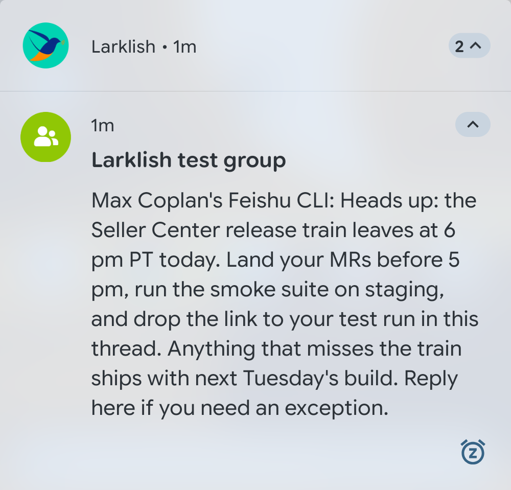
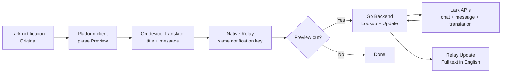

# Larklish: Make every Lark notification understandable

> **A lightweight notification bridge that removes a very real collaboration tax:** Larklish shows your full Lark message in each notification and translates the notification.

## The one-line pitch

Larklish is a full-stack, AI-powered notification bridge for cross-language teams. It listens to Lark notifications on your phone, translates the visible Preview locally, and replaces the Lark notification with the full translated message in the same place the Original appeared. When Lark has truncated the Preview, a Go Backend uses the user's Lark access to perform a targeted Lookup, retrieve the Full text, translate it, and Update the Relay.

The result is deliberately simple for the teammate using it: keep using Lark normally, but understand important messages immediately.

## The two everyday annoyances

Larklish starts from two related failures in the notification experience, not from an abstract desire to add another translation tool.

### 1. Siri cannot read the message

When a Lark notification arrives in Chinese, Siri says she cannot read the message. The notification may be present, but it is not accessible as spoken information. That matters when the user is walking, driving, cooking, exercising, or otherwise relying on audio instead of looking at the screen. A notification that cannot be understood cannot be triaged.

### 2. The user must open Lark for every notification

The alternative is to open Lark every time, find the conversation, translate the message, and decide whether it needs a response. For a busy team, that is a lot of unnecessary app-opening and context switching. It turns every notification into a small interruption, even when most messages are not urgent.

| Everyday failure | Team consequence |
|-|-|
| **Siri cannot read the message** | Spoken notifications fail at the moment the user needs hands-free awareness. |
| **Every notification requires opening Lark** | Triage becomes slow and disruptive, so important mentions, incidents, approvals, and launch changes are easier to miss. |
| **Long messages are truncated** | The visible Preview may omit the detail needed to decide what to do. |
| **Every sender is expected to solve the language gap** | People must change how they communicate, repeat messages, or rely on a colleague as a human translation layer. |

Larklish solves both headline annoyances at their shared boundary: it makes the notification understandable before the user has to open the app, and it puts the English result back into the native notification stream so it can be read or spoken normally.

## The experience: one notification, two layers of help

Larklish keeps the phone’s notification workflow intact.

1. Lark posts an Original notification.
2. The Larklish client receives its title and text through the platform’s notification listener.
3. The Translator translates the text on the phone.
4. Larklish posts a Relay using the same notification key, so it occupies the same familiar notification slot.
5. If the Preview was complete, the Relay is done.
6. If the Preview was cut, the Backend performs a Lookup and Larklish sends an Update containing the Full text in English.

The user does not need to open a second app, copy text, or ask a colleague for help. The useful information arrives where the Original arrived.

## Why Larklish is more than a translation API call

The hard part is the boundary between a notification system and a messaging system. Larklish handles the details that make the experience reliable:

- The app understands Lark’s actual notification shape: the title is the group name and the text begins with the Sender.
- It translates both the group title and the message Preview, preserving the Sender boundary.
- It preserves platform notification identity and follows Lark when Lark withdraws an Original.
- It detects whether the Preview is truncated instead of fetching every message, keeping the common path fast and inexpensive.
- It handles direct messages differently from group chats when resolving a conversation for a Lookup.
- It uses the Lark translation API first and keeps an on-device ML Kit fallback for cases where the API cannot provide a result. A `~` marker makes a fallback visible rather than silently pretending all translations came from the same path.
- It refreshes the user token through the normal Lark user-token chain. The Backend receives the user's access token per request; it does not own a long-lived user session.

These choices turn an apparently small feature into a complete, usable product loop.

## Full-stack architecture

### Frontend: a native experience that stays out of the way

The current Android client is intentionally focused. It owns notification interception, Preview parsing, translation, Relay/Update presentation, the user-token chain, recording, and the editable Backend URL. A future native client on another platform can implement the same small contract while reusing the Backend and product behavior. No client requires changes to the Lark app or cooperation from message senders.

The reference implementation is tested on a rooted Pixel 4a running LineageOS 23.2 / Android 16. That focus let the project optimize for a real end-to-end experience while keeping the product architecture open to other clients.

### Backend: only the expensive path leaves the phone

The Go Backend runs only when a notification Preview is incomplete. It performs the smallest useful Lookup:

`title → chat id → newest messages → matching message → Full text → translation`

It is stateless apart from an in-memory chat cache and LRU. It uses Go’s `net/http` and the official Lark Go SDK, with explicit Bearer authentication between the phone and Backend. The same service can run locally for development or through ByteCloud in production.

### AI and data handling

AI is used exactly where it creates user value: turning Chinese language into English at notification speed. The rest of the system is deterministic and testable: notification parsing, sender extraction, truncation detection, chat resolution, message selection, token handling, and notification replacement.

This division matters. The model or translation service handles language; code handles identity, routing, and safety-sensitive data flow.

## Proof that it works

Larklish has been built by testing the real layers separately and then joining them:

- A sideloaded listener receives real Lark Originals.
- The listener can be granted directly with Android’s notification service command; no special Settings detour is needed on the target device.
- Real test messages have produced English Relays on both Wi-Fi and cellular, with VPN off.
- A long-message probe produced a Relay with a recorded end-to-end time of **1,905 ms** from Original receipt to first Relay. The title translation took 1,341 ms and the message translation took 525 ms in that run.
- The live Backend has returned a real `found` Lookup with English available; the Full text hash matched on the ByteCloud service.
- The phone’s user-token file survived in-place APK installation byte for byte, and the notification listener stayed bound.
- The Go Backend, Android unit tests, formatting checks, static checks, and helper tests pass. The project also maintains a replay corpus for the message-selection rules.

The current acceptance boundary is clear: complete Previews are fully verified on the phone, and the Backend Lookup is verified live. A fresh phone probe that starts with an actually cut Preview is the remaining proof point for claiming the complete Relay-to-Update timing path on the deployed Backend.

## Real team value

Larklish improves several kinds of work at once:

### For the recipient

The recipient gets immediate comprehension without changing their Lark habits. They can triage a notification in seconds, even when they are away from their desk or moving between Wi-Fi and cellular.

### For the sender

The sender can keep writing naturally in the language that is fastest and most precise for them. Larklish removes pressure to write a second English version for every operational message.

### For managers and on-call owners

Urgent messages, mentions, incident coordination, and launch decisions become visible to more of the people who need to act. That reduces the chance that a language boundary becomes an invisible ownership boundary.

### For the organization

The pattern is reusable. The same architecture can become a general bridge for other notification surfaces, language pairs, or accessibility transformations, while the first product remains focused and easy to validate.

## Why this is a strong Full-Stack AI project

Larklish maps directly to the Demo Day criteria:

| Criterion | Larklish evidence |
|-|-|
| **Technical completeness** | A real native frontend reference implementation, notification lifecycle, token chain, Go HTTP Backend, Lark API integration, deployment targets, timing instrumentation, tests, and a working demo path. |
| **Work productivity** | It removes repeated manual translation, reduces context switching, and makes cross-language notifications actionable. |
| **Innovation** | It applies AI at an overlooked boundary—the notification Preview—while preserving the operating system’s native workflow. |
| **Room to evolve** | More languages, smarter policy controls, team distribution, accessibility features, and richer notification actions can build on the same seam. |

Many productivity tools help after a user opens a web page. Larklish helps at the moment a user decides whether a message deserves attention. That is the product insight: **make communication understandable before it becomes work.**

## Demo script

The clearest live demo is a before-and-after on the same phone:

1. Show a Chinese Lark Original in the notification shade.
2. Show the matching English Larklish Relay in the same notification position.
3. Send a long message and show that the ordinary Preview is insufficient.
4. Show the Relay first, then the Backend-driven Update with the Full text.
5. Switch between Wi-Fi and cellular and show that the experience remains local at the notification layer.
6. Open Larklish settings to show the Backend URL and the diagnostic record of Relay, Update, fallback, and timing events.

The audience should leave with one memorable idea:

> **Larklish does not ask the team to communicate differently. It makes the communication they already have immediately usable.**

## Project status and next step

Larklish is a real working app with a live ByteCloud deployment. 

The next acceptance step is a marked or naturally cut Preview on the deployed Backend, verifying the final Relay-to-Update timing row end to end. That is a small validation step—not a change to the product thesis or architecture.

---

**Larklish — translate less in your head, miss less in your day.** 🚀
